# How to Run the Client

On top of the instructions shown in Lab 1 (Set up EC2 and Tomcat), Lab 2 (Set up and run Servlet on Tomcat hosted by EC2), and Lab 3 (Set up client), users can find all the configuration parameters that need to be updated in `ski.resort.distributed.system.constants.UserConfig`, as detailed below.

```java
package ski.resort.distributed.system.constants;

import io.github.cdimascio.dotenv.Dotenv;

public class UserConfig {

  /** 1. Base path or URL for API requests */

  // (a) Define the local base path
  private static final String LOCAL_BASE_PATH = "http://localhost:8080/Server_war_exploded";

  // (b) Define the remote base path with the correct HOST_IP
  private static final String HOST_IP = Dotenv.load().get("MY_EC2_IP");
  private static final String REMOTE_BASE_PATH = "http://" + HOST_IP + ":8080/Server_war";

  // (c) Toggle between local and remote base path: true for remote, false for local
  public static final boolean USE_REMOTE = true;
  public static final String BASE_PATH = USE_REMOTE ? REMOTE_BASE_PATH : LOCAL_BASE_PATH;

  /** 2. Whether to note down latency for each post */
  public static final boolean RECORD_POSTS_IN_CSV = false;

  public UserConfig() {}
}
```

**1. Remote vs Local Server**
- If the user runs the server locally, set `USE_REMOTE` to `false`.
- If the user runs the server on EC2, create a `.env` file in the `Client` project root directory and add `MY_EC2_IP=<Your EC2 public IP address>` (e.g., `MY_EC2_IP=35.164.156.188`). The `Dotenv` dependency will retrieve this while compiling.

**2. Client 1 vs Client 2**
- To run as **Client 1** without CSV logging, set `RECORD_POSTS_IN_CSV` to `false`.
- To run as **Client 1** with CSV logging being enabled, set `RECORD_POSTS_IN_CSV` to `true`.

**3. Number of Threads in Phase 2**
- Currently, the number of threads in phase 2 is set to a random value in `doPhaseTwo` method in `Client.java`.
- If the user wants to test a specific number of threads, they are welcome to set a fixed number instead.
```java
final int threadCount = (new Random().nextInt(3, 25)) * 10; // Change to fix number if needed
```


# Design and Implementation

On the server side, private helper functions are used to validate the URL, including checking its length, number format, etc. Further processing logic will be added as the project develops.

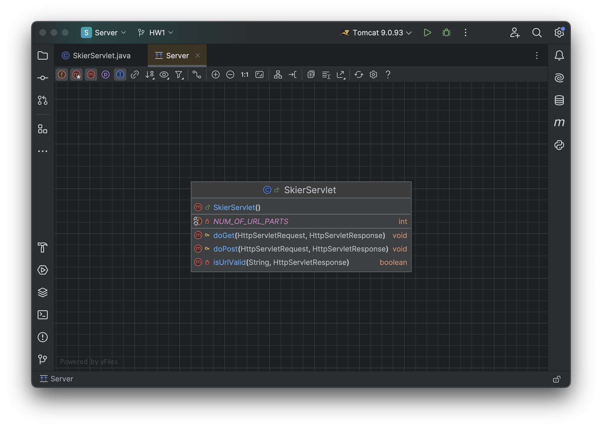

The Client project structure is as follows. The `constants` package stores `Constants` as specified in the assignment, as well as `UserConfig`, which includes:
1. A boolean value to toggle between talking to a local server or a remote server (IP address needed in `.env`).
2. A boolean value to toggle whether to log individual events (i.e., **Client 2**) or not to log (i.e., **Client 1**).

```
qiuyingzhuo@Qiuyings-MacBook system % tree
.
├── Client.java
├── constants
│   ├── Constants.java
│   └── UserConfig.java
├── models
│   ├── Event.java
│   ├── EventLog.java
│   └── PostWorkerParam.java
└── runnables
    ├── EventGenerator.java
    ├── EventLogWorker.java
    └── PostRequestWorker.java

```


The `models` package contains the data models facilitating the construction and execution of the runnable tasks, while the `runnables` package, categorized by their function, constitutes the main part of the design. Specifically:

- The `EventGenerator` runnable is tasked with generating random `Event` instances, and put it in the event blocking queue.
- The `EventLogWorker` runnable is responsible for retrieving `EventLog` instances from the log blocking queue, if any, and saving them to a CSV file. It will run only if the user chooses to write the records in a CSV file (i.e., in the case of **Client 2**).
- Each `PostRequestWorker` shares the blocking queue with `EventGenerator` to retrieve `Event` instances, generate, and send HTTP requests via the `Swagger` agent. If CSV logging is enabled, it will also share the log blocking queue with `EventLogWorker`. It will generate `EventLog` instances and put them in the queue for further processing.

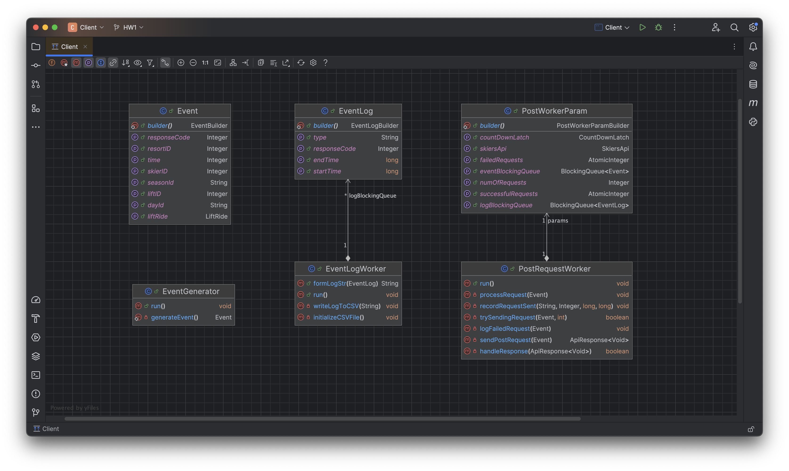

The `main` method in `Client` orchestrates everything, such as creating blocking queues as needed and passing them into the relevant runnables, submitting tasks (via `ExecutorService`), etc.

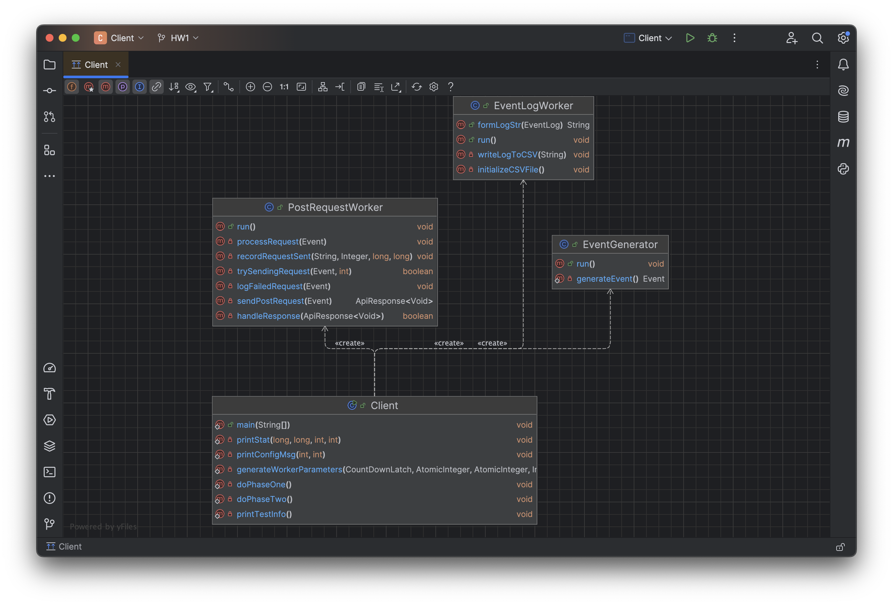

Regarding concurrency, the following classes and data structures are used:

- There is a dedicated thread for `EventGenerator` to generate `Event` instances and a dedicated thread for `EventLogWorker` if the user chooses to write records into a CSV file. There is also a fixed-size thread pool managed by `ExecutorService` handling multiple post reqeust workers (they are runnables too).
- We need to wait for all threads to finish in phase 1 before starting phase 2, and we want to know when phase 2 ends as well. `CountDownLatch` is used as a barrier between phases and to facilitate tracking these important moments.
- For storing data to be processed, `LinkedBlockingQueue` is used because it is thread-safe when being consumed and produced by multiple threads at the same time.
- Likewise, counters that need to be shared across multiple threads must be thread-safe. `AtomicInteger` is chosen for this purpose.

# Little's Law Estimation

If we set Phase 1 to 32 threads and Phase 2 to 150 threads. Using **Little's Law**, we can estimate the throughput using the formula `N = λW`, or `λ = N/W` where:
* `N` is the long-term average number of customers in the system
* `λ` is the long-term average effective arrival rate
* `W` is the average time a customer spends in the system

Since the project is divided into two phases, and the thread count is less than Tomcat's configuration of 200 threads, `N` will be the number of client threads. Considering that most of the 200,000 tasks are processed in Phase 2, we assume `N = 150` and an average wait time of `W = 32 ms`. This gives us `λ = 4680`. 

# Testing Output Analysis

If we set Phase 1 to 32 threads and Phase 2 to 150 threads:

Without logging individual latency into the CSV file (i.e., running as **Client 1**), we have the following output:
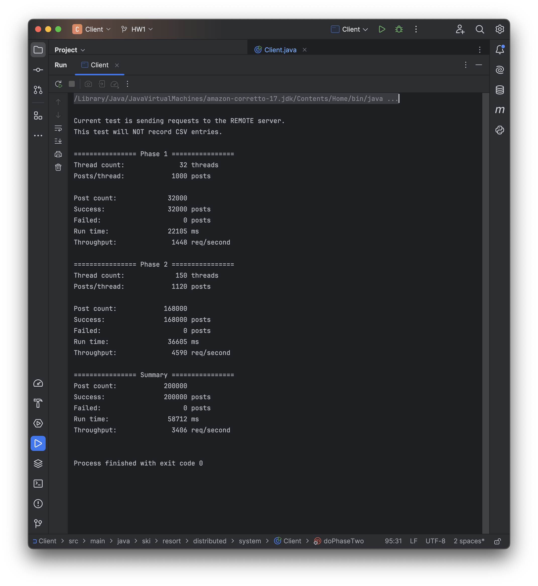

Using the same settings but recording latency for each request into the CSV file (running as **Client 2**), we have the following output:
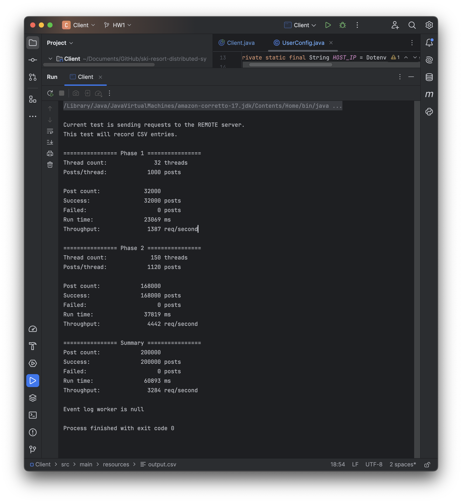

The difference in overall throughput for **Client 1** and **Client 2**, calculated as `1 - (3284 / 3406)`, is less than `5%`, which is within the specification described in the assignment.

Meanwhile, the throughput observed in Phase 2 (ranging from 44k to 46k in varoius tests) is **close to the Little's Law predictions**.

Other **statistics** are shown below:
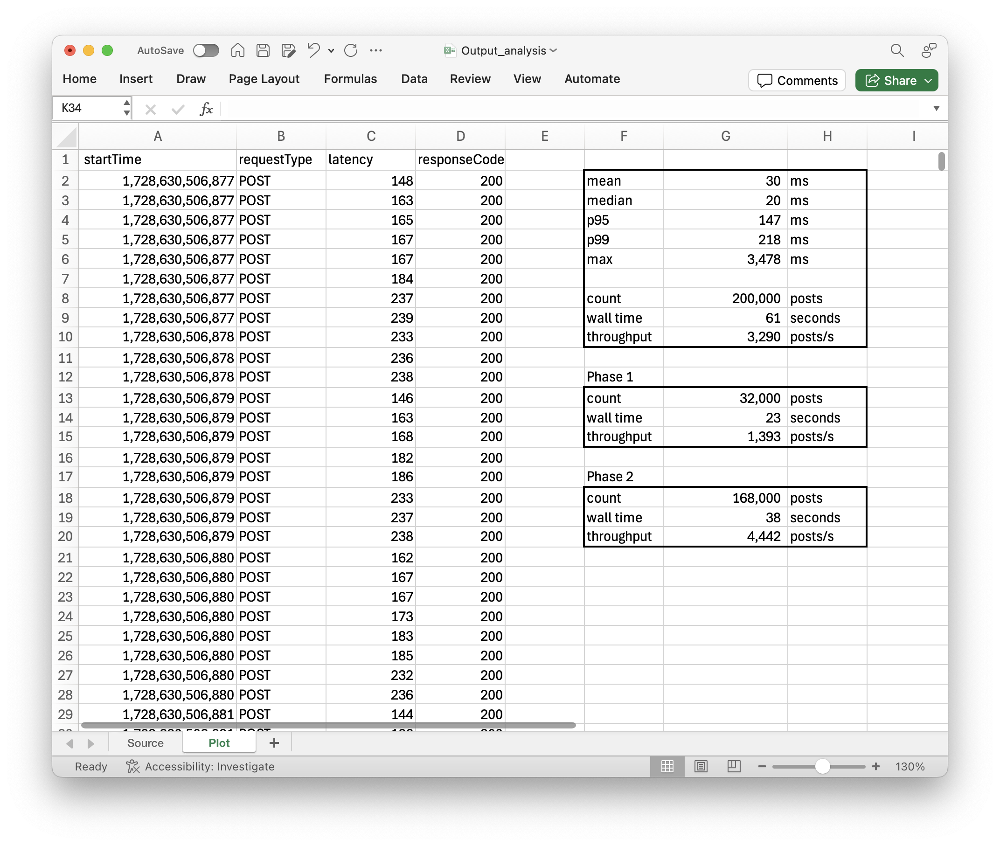

The graph below shows the **throughput over time**, which aligns with the test settings and observed results. Initially, with 32 threads, each sending 1,000 requests, the throughput ranges from 1.3k to 1.5k requests/second. Later, when the thread count increases to 150 threads, each sending 1,120 requests, the throughput fluctuates between 3.0k and 7.0k requests/second, overally reflecting **increased concurrency**.

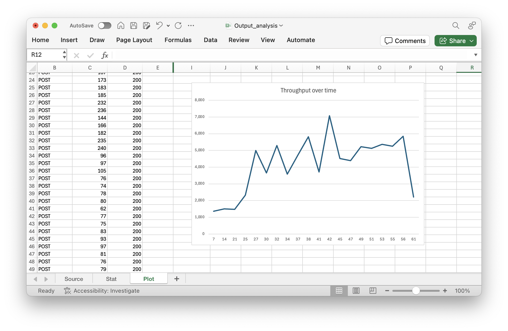


# Appendix

TomCat JXM query: 200k requests being processed
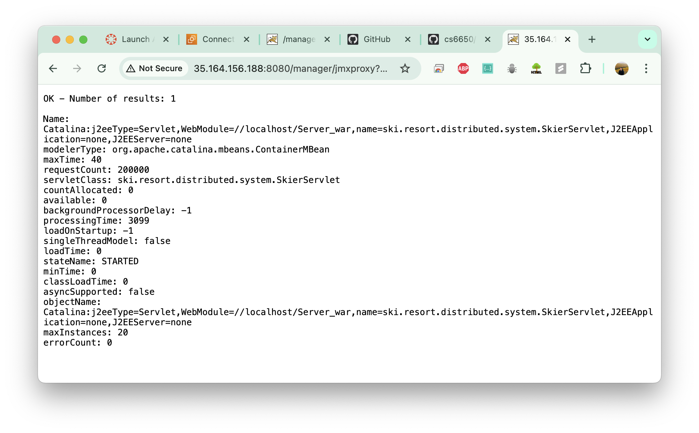

TomCat status: 200 threads
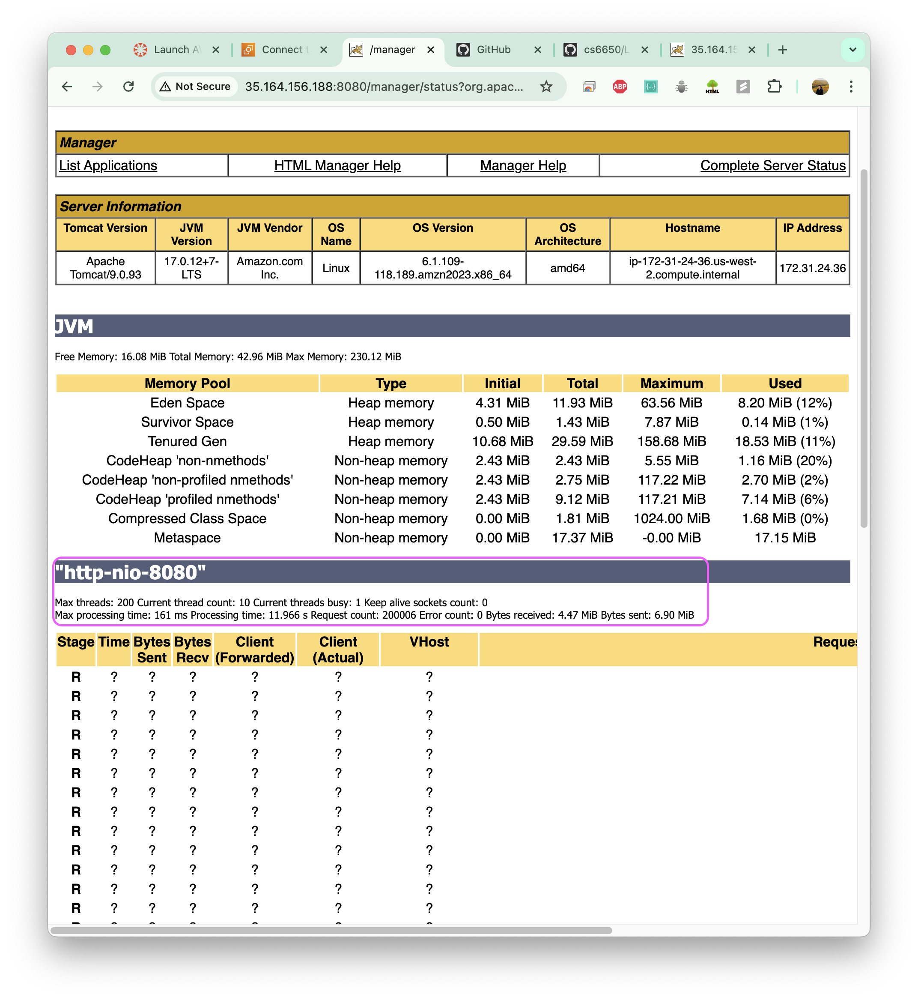

Postman: valid Get
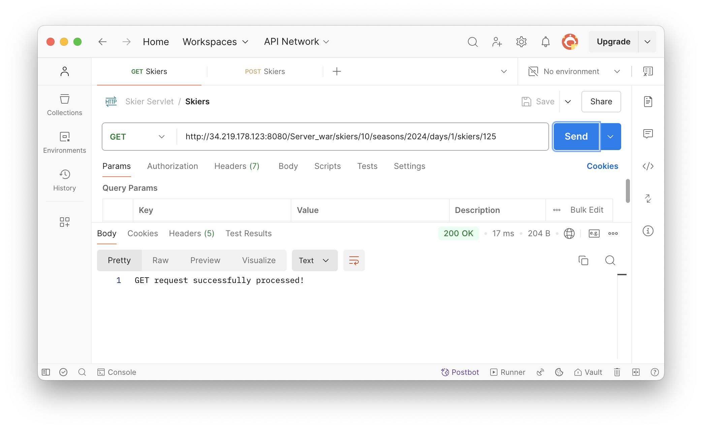

Postman: valid Post


Postman: invalid Post 1
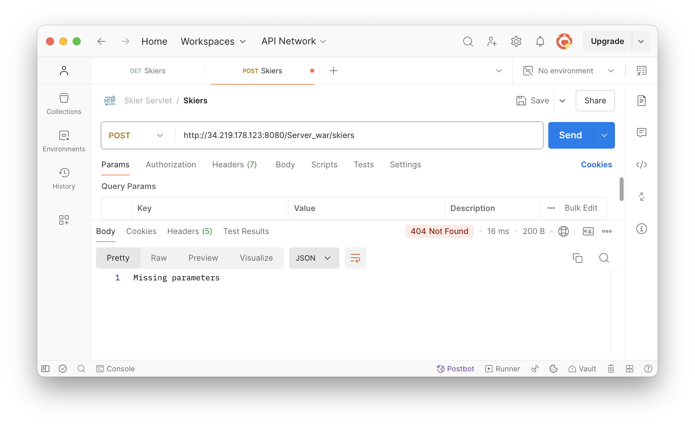

Postman: invalid Post 2
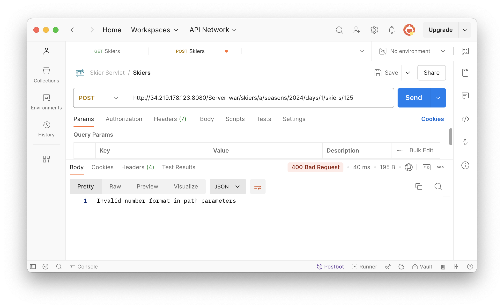