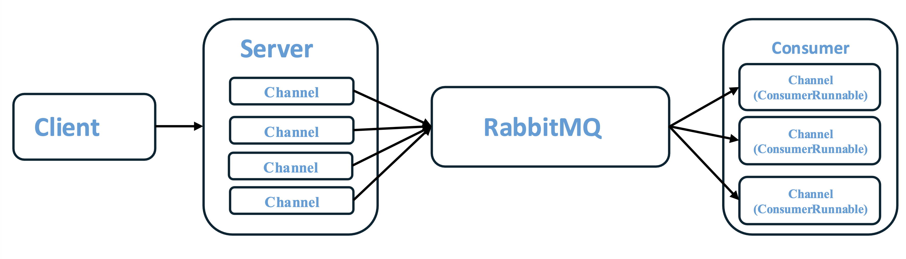
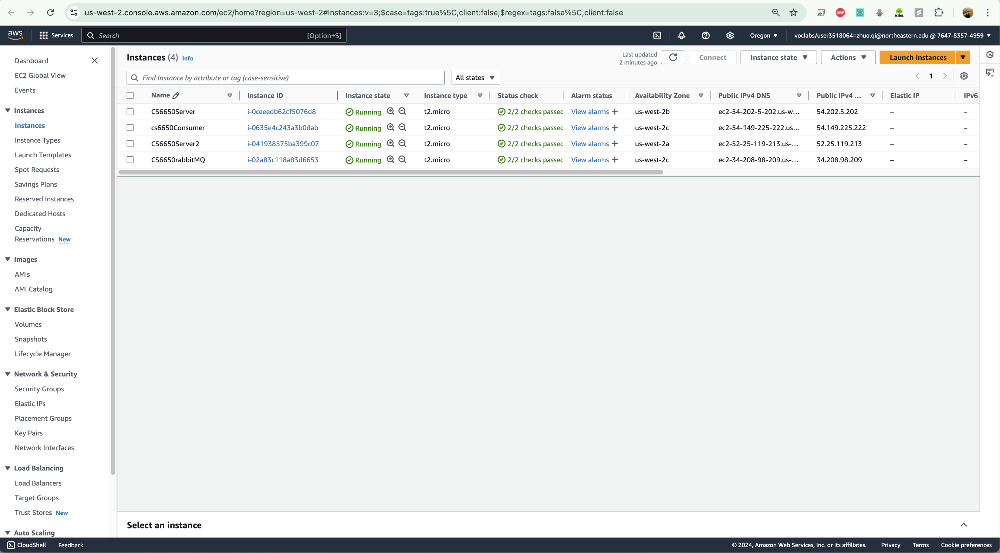
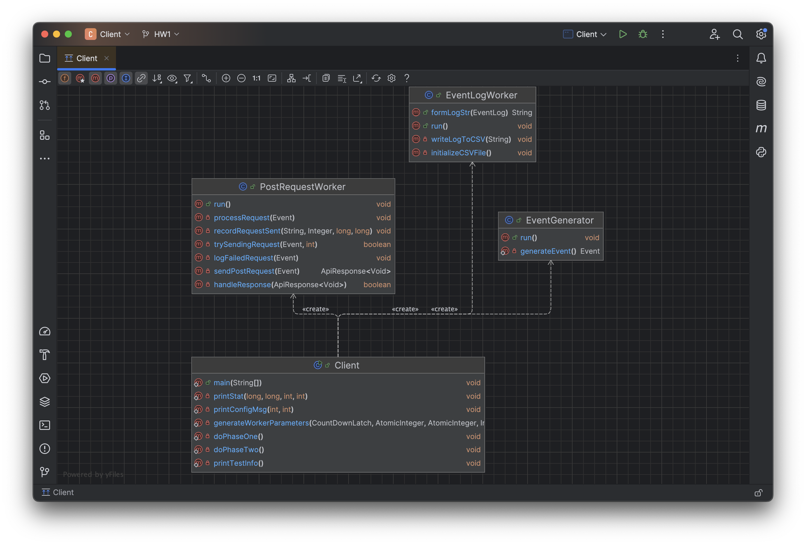
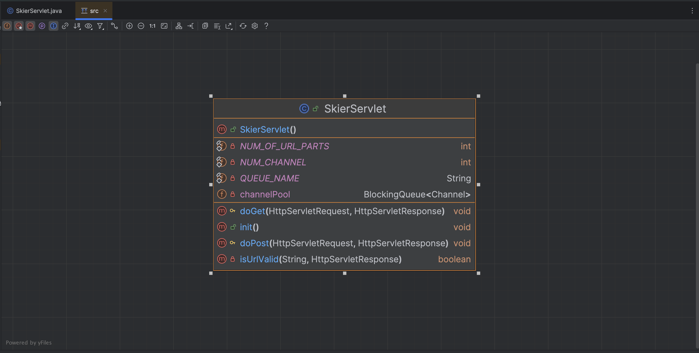
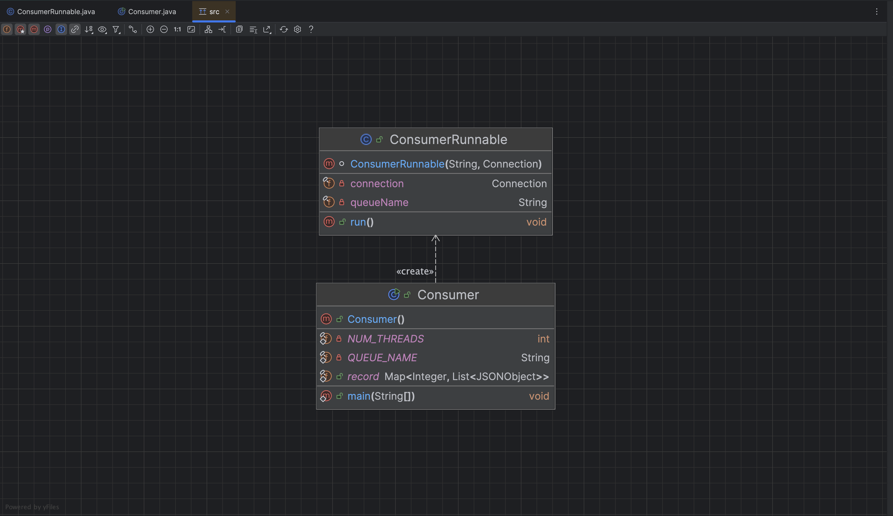
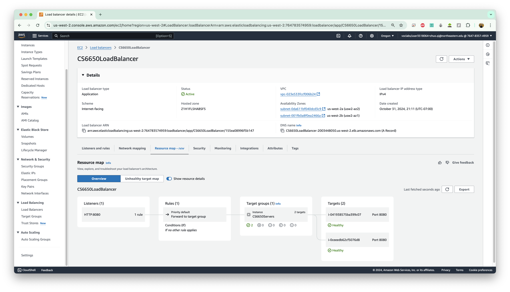
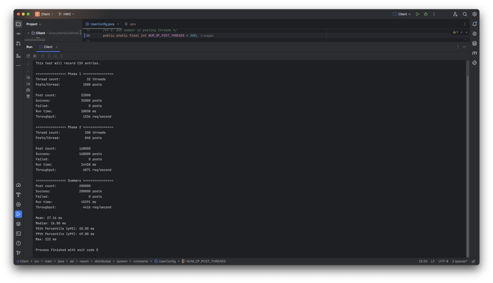
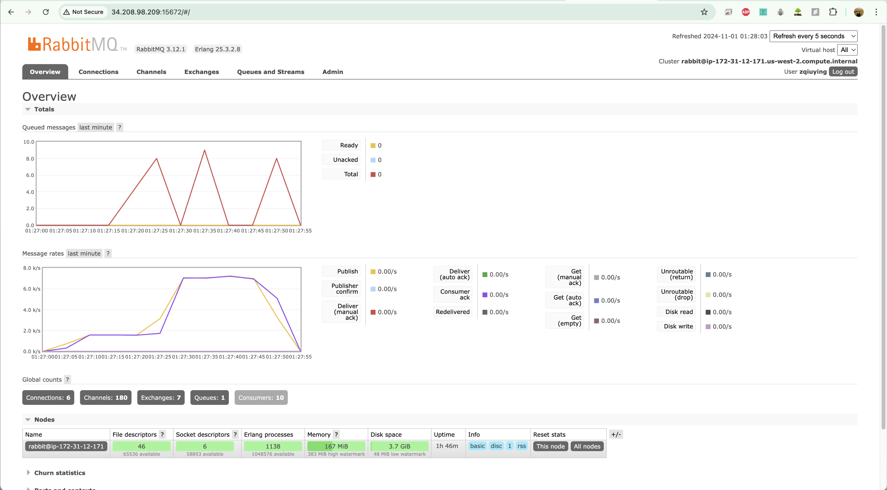
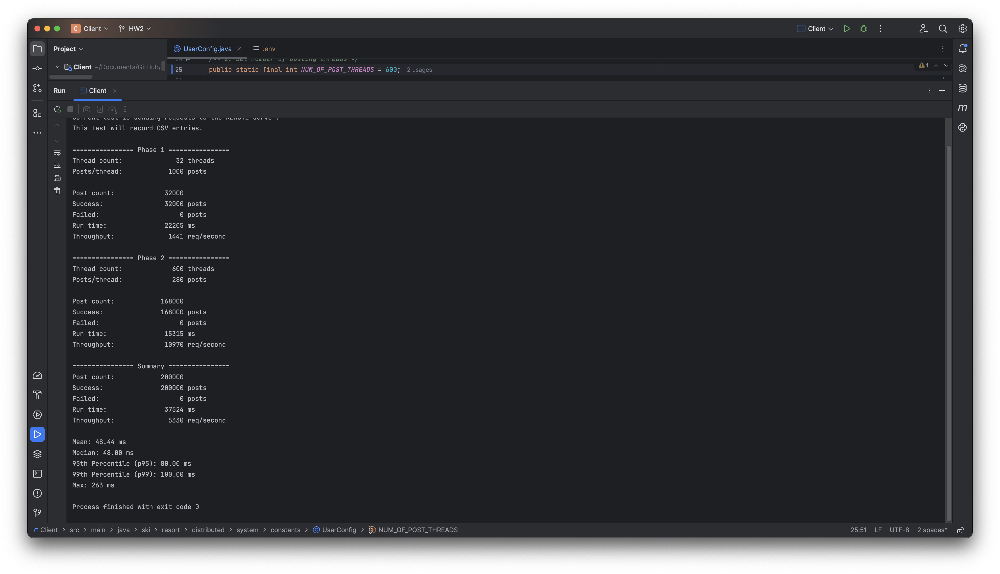

# URL to the Github Repository

Please visit [Github Repository](https://github.com/z-q-ying/ski-resort-distributed-system/tree/main/Assignment2).

# Design and Implementation

The system comprises four components: Client, Server, RabbitMQ, and Consumer. The Client runs on a local machine, while the Server, RabbitMQ, and Consumer each run on separate EC2 instances. The following diagram illustrates the overall data flow among the components (excluding the Client) running on different EC2 instances.

## Client
The Client is largely the same as Assignment 1. As shown below, the `main` method in `Client` orchestrates everything, such as creating blocking queues as needed and passing them into the relevant runnables, submitting tasks (via `ExecutorService`), etc.

## Server

The main class of server implementation is `SkiersServlet`, with the class diagram shown below:

`SkiersServlet` class contains the following variables.

* `NUM_OF_URL_PARTS`: Defines the expected number of parts in the URL path (expected as 8 parts).
* `NUM_CHANNEL`: Specifies the number of channels to initialize for handling RabbitMQ messaging. The value is 50.
* `QUEUE_NAME`: Name of the RabbitMQ queue used for sending POST requests (queue name is "SkierServletPostQueue").
* `channelPool`: A thread-safe queue (using `BlockingQueue`) to manage multiple RabbitMQ channels concurrently. The pool allows `NUM_CHANNEL` channels to be reused among threads to avoid repeatedly creating and closing channels.

`SkiersServlet` class contains the following methods.

* `init()`

  The `init()` method is called once when the servlet is initialized. It sets up the RabbitMQ connection and populates the `channelPool` with a set number of pre-configured channels.

  * Connection Setup:
    
    Creates a new `ConnectionFactory`, setting the host, port, username, and password for RabbitMQ.
  
    Establishes a new `connection` using the factory. If unsuccessful, it catches and logs any exceptions.
  
  * Channel Pool Setup:
    
    Creates `NUM_CHANNEL` channels from the established connection, configuring each to declare the `QUEUE_NAME` queue.
    
    Adds each channel to `channelPool`.

* `isUrlValid()`

  A helper method to validate the URL path. It checks:

  * Path Presence and Structure:
    
    Ensures the URL path is not null or empty.
    
    Confirms that the path has exactly NUM_OF_URL_PARTS.

  * Numeric Format Validation:
    
    Attempts to parse specific path segments (e.g., resortID and skierID) as integers.
    
  If any segment fails to parse, it returns 400 Bad Request.

* `doGet()`

  Handles GET requests.

  * URL Validation: Validates the URL path by calling `isUrlValid()`.

  * Response Handling:
    
    If valid, sets HTTP response status to `200 OK` and writes a success message to the response body.

    If invalid, `isUrlValid()` will handle setting the appropriate response status and message.

* `doPost()`

  Handles POST requests.

  1. URL Validation: Uses `isUrlValid()` to validate the URL path. If invalid, an error response is returned.

  2. Request Body Parsing:

      Reads the body of the POST request and converts it to a JSON object for further processing.

  3. Additional JSON Data:
    
      Extracts additional information from the URL (i.e., `resortID`, `seasonID`, `dayID`, and `skierID`) and appends this data to the JSON object.

  4. Publishing to RabbitMQ:

      Retrieves a channel from `channelPool`.

      Publishes the JSON object to the `QUEUE_NAME` queue.
    
      Adds the channel back to `channelPool` for future use.

  5. Response Handling: Sets HTTP response status to 201 Created and sends a success message.

## RabbitMQ

RabbitMQ runs on a separate EC2 instance. By selecting `Ubuntu` as the OS image and following the [official documentation](https://www.rabbitmq.com/docs/install-debian#install-packages), `rabbitmq-server` is set up on the EC2 instance with the username `zqiuying` and the password `LoveCoding`. Lastly, the EC2 instances that run `Server` and `Consumer`are allowed to connect to RabbitMQ by adding their IPs to the `inbound rules`.

## Consumer

Running as a separate application in another EC2 instance, `Consumer` and `ConsumerRunnable` work together to consume messages from the RabbitMQ queue and process skier data. The `Consumer` class acts as the main entry point, setting up the RabbitMQ connection and threading, while `ConsumerRunnable` handles individual message processing. The following diagram shows the design and dependency of these class.

The `Consumer` class initializes the connection to RabbitMQ and creates a thread pool to execute ConsumerRunnable instances for processing messages concurrently.

  * Constants:

    `NUM_THREADS`: The number of consumer threads to be created for concurrent message processing. The value is `10`.

    `QUEUE_NAME`: Specifies the name of the queue from which messages will be consumed (`"SkierServletPostQueue"`).

    `record`: A thread-safe, concurrent map (`ConcurrentHashMap`) used to store `JSONObject` messages for each skier, where skierID is the key, and a synchronized list of JSONObjects (the skier’s data) is the value.

  * main(String[] args):

    Connection Setup: Initializes `ConnectionFactory` with RabbitMQ credentials and settings.

    Executor Service: Creates a custom `ExecutorService` for RabbitMQ and opens a connection to RabbitMQ.

    Thread Pool for Consumers: Creates a fixed thread pool with `NUM_THREADS` and submits `ConsumerRunnable` tasks to the pool, each responsible for consuming messages from the queue.

The `ConsumerRunnable` class is a `Runnable` implementation that handles message processing for a single thread. Each instance listens to the queue and processes messages as they arrive.

  * Fields:

    `queueName`: The queue name from which messages are consumed.

    `connection`: The RabbitMQ Connection used to create a channel.

  * `run()`:

    Channel Setup: Creates a new Channel for consuming messages from the specified queue.

    Message Handling (DeliverCallback):
      
      * Processes each message by converting it from bytes to a UTF-8 string, then parsing it into a JSONObject.

      * Retrieves skierID from the JSON and stores the message in the record map. If the skierID already exists, it appends the message to the existing list; otherwise, it creates a new synchronized list.

      * Acknowledges (ACKs) each message once processed.

    CancelCallback: Defined but empty, serving as a placeholder for message cancel operations.

After generating the `.jar file`, upload it to a separate EC2 instance and execute it there. To verify, a log message is printed during the testing phase.

# Load Balancing

To increase throughput, we deployed two EC2 instances for servlets and configured an AWS Application Load Balancer to route traffic between them. The load balancer listens for HTTP requests on port 8080 and forwards these requests to a target group containing the two instances. Ensure that the security group for the load balancer has permissions to send requests to the EC2 instances for servlets.

# Testing Output Analysis

The tests are conducted using a single servlet and a load-balanced servlet cluster with varying thread counts on the Client side to determine the optimal throughput.

## Single Servlet

Tests were conducted using thread counts of `100`, `200`, and `300` on the Client side, with a focus on throughput during phase 2. The highest throughput achieved was `6871` with `200` threads, and the RabbitMQ queue length remained minimal.

## Load-balanced Servlet Cluster

Tests were conducted using thread counts of `150`, `300`, `450`, `600`, `750` and `800` on the Client side, with a focus on throughput during phase 2. The highest throughput achieved was `10970` with `600` threads, and the RabbitMQ queue length remained minimal.

## Further Analysis

### Throughput

A load-balanced cluster with two instances running the servlet shows a performance improvement of around `60%`, though not doubling, likely due to overhead between the Server and RabbitMQ.

In the single-servlet scenario, as the thread count increases to `300`, request retries begin to appear, indicating network overload and a rise in failed requests as the single servlet becomes insufficient.

In the load-balanced cluster scenario, we observe that when the thread count reaches higher values (e.g., `600`, `750`, and `800`), throughput levels off at approximately `10,500`, suggesting that at this thread count, network resources to the Server are fully utilized.

### Queue Length

An interesting finding is that the queued messages in RabbitMQ remain minimal even with high Client thread counts. This suggests that the Consumer is effectively processing messages from the queue, as seen in the Publish/Deliver rates figure. It also implies that throughput could be further improved by increasing the publish rate, achievable by tuning `NUM_CHANNEL` and adjusting queue configurations on the Server side.
