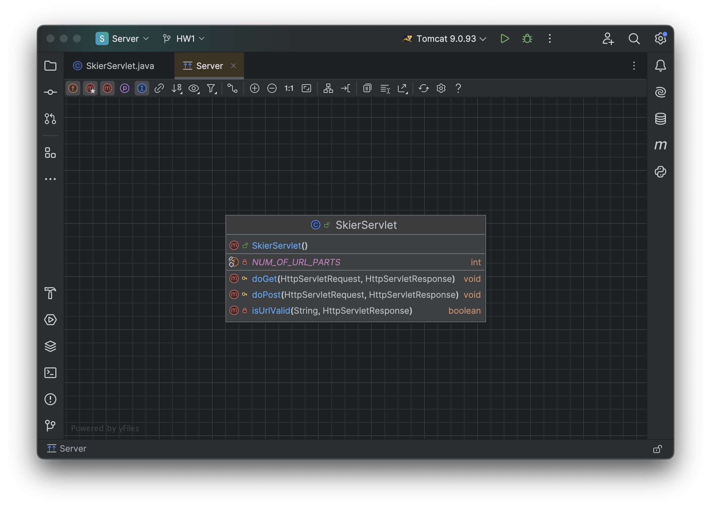
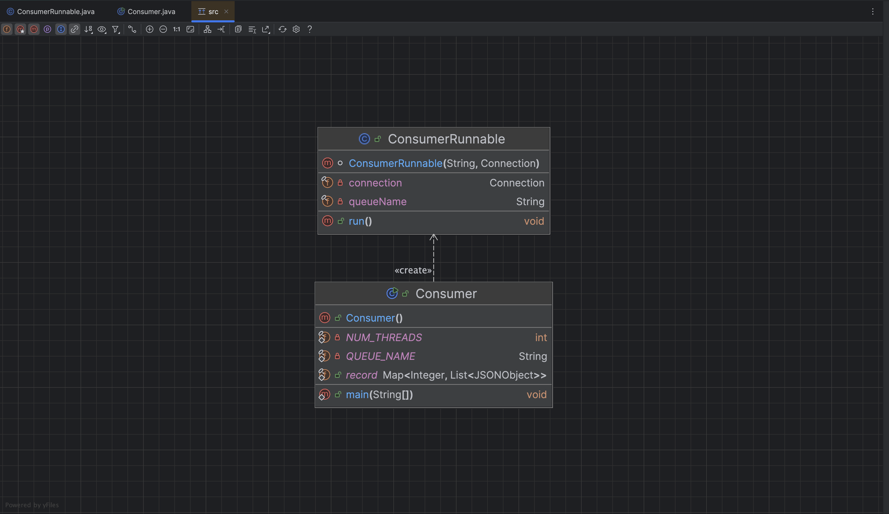
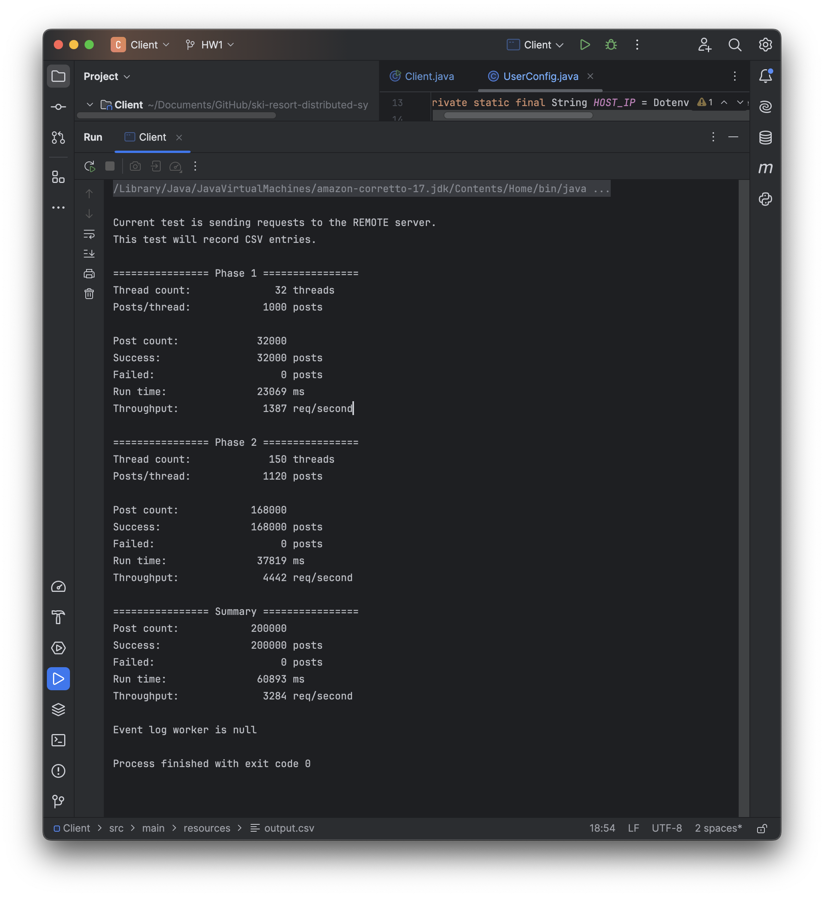
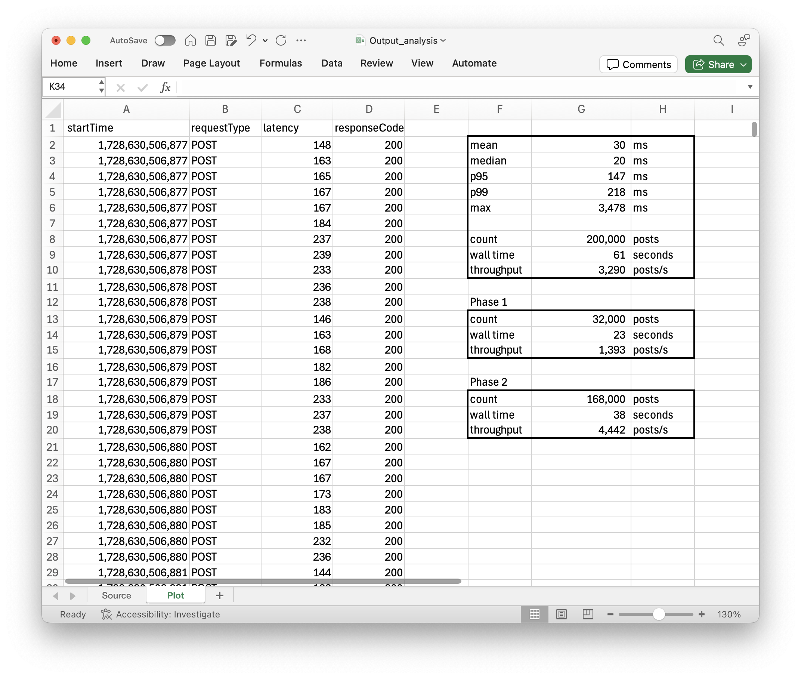
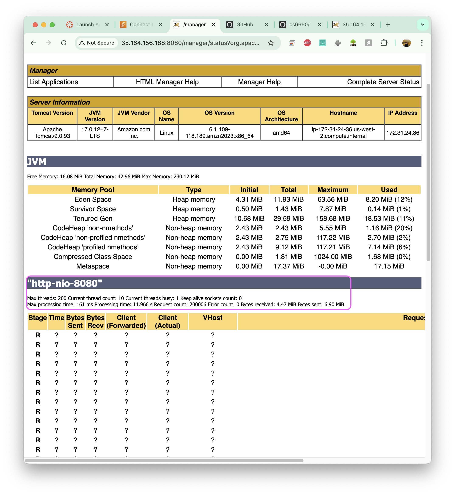
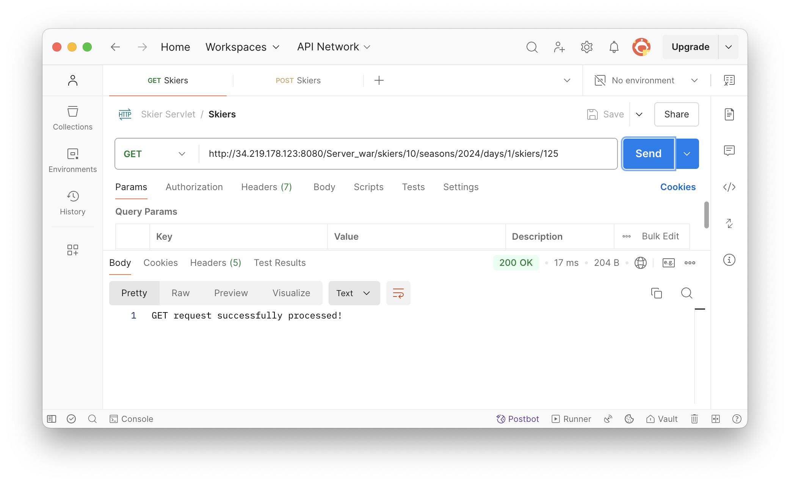
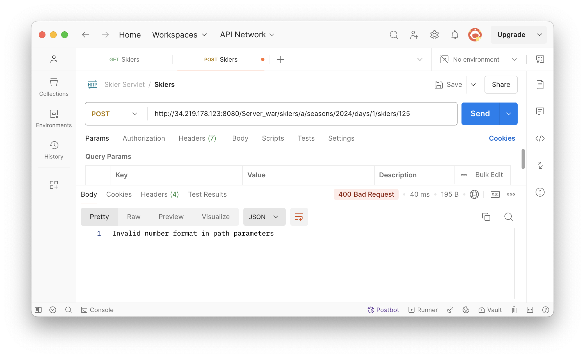

# How to Run the Client

Similar to Assignment 1, users can find all the configuration parameters that need to be updated in `ski.resort.distributed.system.constants.UserConfig`, as detailed below.

```java
package ski.resort.distributed.system.constants;

import io.github.cdimascio.dotenv.Dotenv;

public class UserConfig {

  /** 1. URL for API requests */
  private static final String HOST_IP = Dotenv.load().get("MY_EC2_IP");
  public static final String BASE_PATH = "http://" + HOST_IP + ":8080/Server_war";

  /** 2. Whether to note down latency for each post */
  public static final boolean RECORD_POSTS_IN_CSV = false;

  public UserConfig() {}
}
```

**1. Remote Server**
- Create a `.env` file in the `Client` project root directory and add `MY_EC2_IP=<Your EC2 public IP address>` (e.g., `MY_EC2_IP=35.164.156.188`). The `Dotenv` dependency will retrieve this while compiling.

**2. Client 1 vs Client 2**
- To run as **Client 1** without CSV logging, set `RECORD_POSTS_IN_CSV` to `false`.
- To run as **Client 2** with CSV logging being enabled, set `RECORD_POSTS_IN_CSV` to `true`.

**3. Number of Threads in Phase 2**
- Currently, the number of threads in phase 2 is set to a random value in `doPhaseTwo` method in `Client.java`.
- If the user wants to test a specific number of threads, they are welcome to set a fixed number instead.
```java
final int threadCount = (new Random().nextInt(3, 25)) * 10; // Change to fix number if needed
```

# Design and Implementation

The system contains 4 different components.


## Client
The Client is not changed from Assignment 1. As shown below, the `main` method in `Client` orchestrates everything, such as creating blocking queues as needed and passing them into the relevant runnables, submitting tasks (via `ExecutorService`), etc.


## Server

The main class of server implementation is `SkiersServlet`, with the class diagram shown below:



`SkiersServlet` class contains the following variables.

* `NUM_OF_URL_PARTS`: Defines the expected number of parts in the URL path (expected as 8 parts).
* `NUM_CHANNEL`: Specifies the number of channels to initialize for handling RabbitMQ messaging.
* `QUEUE_NAME`: Name of the RabbitMQ queue used for sending POST requests (queue name is "SkierServletPostQueue").
* `channelPool`: A thread-safe queue (using `BlockingQueue`) to manage multiple RabbitMQ channels concurrently. The pool allows `NUM_CHANNEL` channels to be reused among threads to avoid repeatedly creating and closing channels.

`SkiersServlet` class contains the following methods.

* `init()`

  The `init()` method is called once when the servlet is initialized. It sets up the RabbitMQ connection and populates the `channelPool` with a set number of pre-configured channels.

  * Connection Setup:
    
    Creates a new `ConnectionFactory`, setting the host, port, username, and password for RabbitMQ.
  
    Establishes a new `connection` using the factory. If unsuccessful, it catches and logs any exceptions.
  
  * Channel Pool Setup:
    
    Creates `NUM_CHANNEL` channels from the established connection, configuring each to declare the `QUEUE_NAME` queue.
    
    Adds each channel to `channelPool`.

* `isUrlValid()`

  A helper method to validate the URL path. It checks:

  * Path Presence and Structure:
    
    Ensures the URL path is not null or empty.
    
    Confirms that the path has exactly NUM_OF_URL_PARTS.

  * Numeric Format Validation:
    
    Attempts to parse specific path segments (e.g., resortID and skierID) as integers.
    
  If any segment fails to parse, it returns 400 Bad Request.

* `doGet()`

  Handles GET requests.

  * URL Validation: Validates the URL path by calling `isUrlValid()`.

  * Response Handling:
    
    If valid, sets HTTP response status to `200 OK` and writes a success message to the response body.

    If invalid, `isUrlValid()` will handle setting the appropriate response status and message.


* `doPost()`

  Handles POST requests.

  1. URL Validation: Uses `isUrlValid()` to validate the URL path. If invalid, an error response is returned.

  2. Request Body Parsing:

      Reads the body of the POST request and converts it to a JSON object for further processing.

  3. Additional JSON Data:
    
      Extracts additional information from the URL (i.e., `resortID`, `seasonID`, `dayID`, and `skierID`) and appends this data to the JSON object.

  4. Publishing to RabbitMQ:

      Retrieves a channel from `channelPool`.

      Publishes the JSON object to the `QUEUE_NAME` queue.
    
      Adds the channel back to `channelPool` for future use.

  5. Response Handling: Sets HTTP response status to 201 Created and sends a success message.


## Consumer

Running as a separate application in another EC2 instance, `Consumer` and `ConsumerRunnable` work together to consume messages from the RabbitMQ queue and process skier data. The `Consumer` class acts as the main entry point, setting up the RabbitMQ connection and threading, while `ConsumerRunnable` handles individual message processing. The following diagram shows the design and dependency of these class.



The `Consumer` class initializes the connection to RabbitMQ and creates a thread pool to execute ConsumerRunnable instances for processing messages concurrently.

  * Constants:

    `NUM_THREADS`: The number of consumer threads to be created for concurrent message processing.

    `QUEUE_NAME`: Specifies the name of the queue from which messages will be consumed (`"SkierServletPostQueue"`).

    `record`: A thread-safe, concurrent map (`ConcurrentHashMap`) used to store `JSONObject` messages for each skier, where skierID is the key, and a synchronized list of JSONObjects (the skier’s data) is the value.

  * main(String[] args):

    Connection Setup: Initializes `ConnectionFactory` with RabbitMQ credentials and settings.

    Executor Service: Creates a custom `ExecutorService` for RabbitMQ and opens a connection to RabbitMQ.

    Thread Pool for Consumers: Creates a fixed thread pool with `NUM_THREADS` and submits `ConsumerRunnable` tasks to the pool, each responsible for consuming messages from the queue.

The `ConsumerRunnable` class is a `Runnable` implementation that handles message processing for a single thread. Each instance listens to the queue and processes messages as they arrive.

  * Fields:

    `queueName`: The queue name from which messages are consumed.

    `connection`: The RabbitMQ Connection used to create a channel.

  * `run()`:

    Channel Setup: Creates a new Channel for consuming messages from the specified queue.

    Message Handling (DeliverCallback):
      
      * Processes each message by converting it from bytes to a UTF-8 string, then parsing it into a JSONObject.

      * Retrieves skierID from the JSON and stores the message in the record map. If the skierID already exists, it appends the message to the existing list; otherwise, it creates a new synchronized list.

      * Acknowledges (ACKs) each message once processed.

    CancelCallback: Defined but empty, serving as a placeholder for message cancel operations.

# Testing Output Analysis

If we set Phase 1 to 32 threads and Phase 2 to 150 threads:

Without logging individual latency into the CSV file (i.e., running as **Client 1**), we have the following output:


Using the same settings but recording latency for each request into the CSV file (running as **Client 2**), we have the following output:


The difference in overall throughput for **Client 1** and **Client 2**, calculated as `1 - (3284 / 3406)`, is less than `5%`, which is within the specification described in the assignment.

Meanwhile, the throughput observed in Phase 2 (ranging from 44k to 46k in varoius tests) is **close to the Little's Law predictions**.

Other **statistics** are shown below:


The graph below shows the **throughput over time**, which aligns with the test settings and observed results. Initially, with 32 threads, each sending 1,000 requests, the throughput ranges from 1.3k to 1.5k requests/second. Later, when the thread count increases to 150 threads, each sending 1,120 requests, the throughput fluctuates between 3.0k and 7.0k requests/second, overally reflecting **increased concurrency**.


# Appendix

TomCat JXM query: 200k requests being processed


TomCat status: 200 threads


Postman: valid Get


Postman: valid Post


Postman: invalid Post 1


Postman: invalid Post 2

