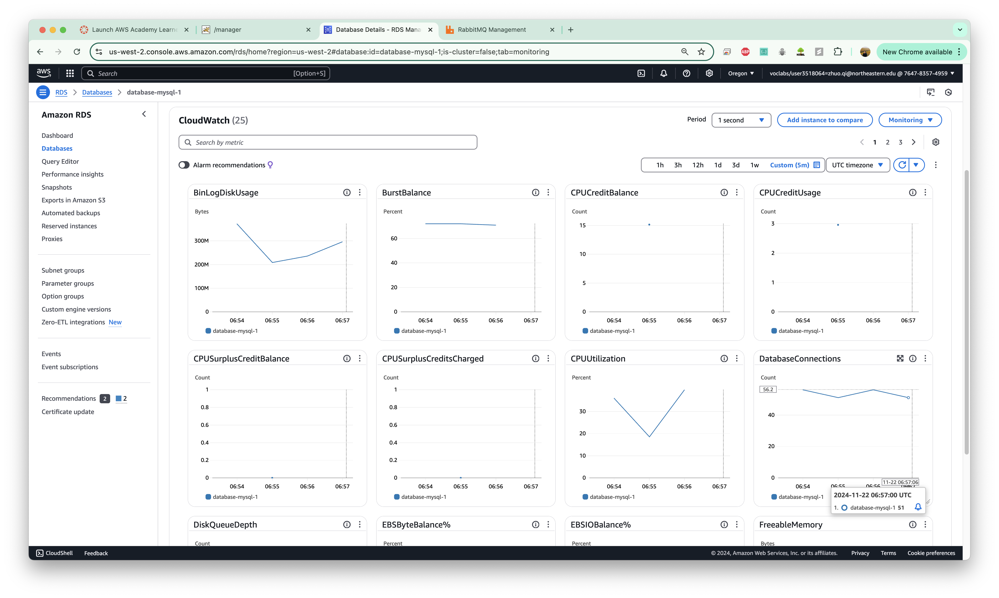
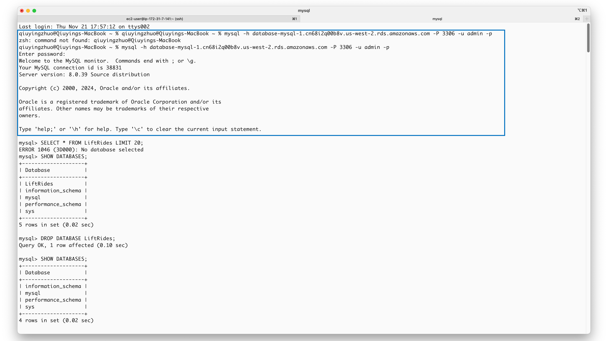
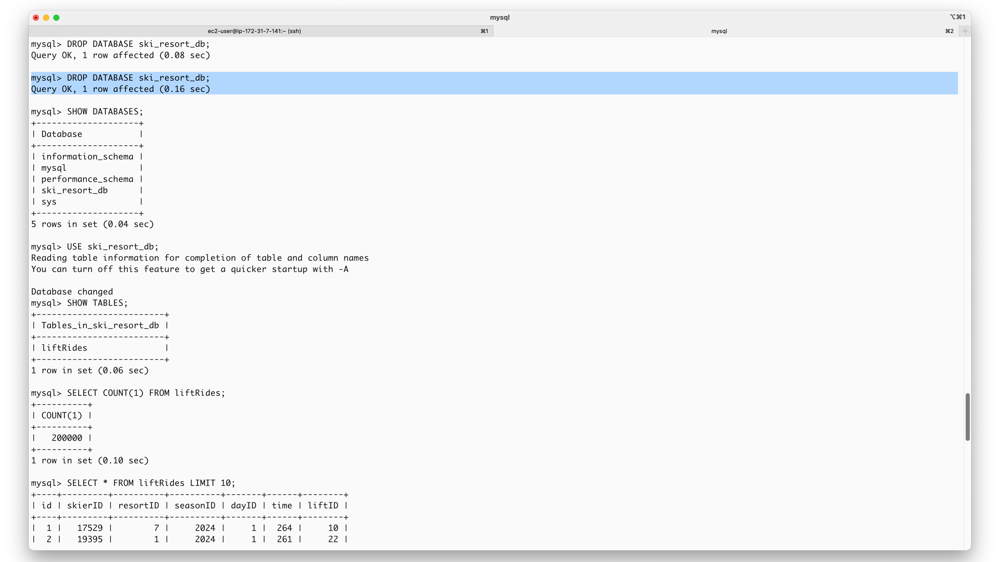

# URL to the Github Repository

Please visit this [Github Repository](https://github.com/z-q-ying/ski-resort-distributed-system/tree/main/Assignment3).

# Design and Implementation

The system is composed of five key components: Client, Server, RabbitMQ, Consumer, and Database. The Client runs locally, while the Server, RabbitMQ, and Consumer are hosted on separate EC2 instances. The Database, introduced as a key element in this Assignment 3, leverages the AWS RDS MySQL engine for data storage.


## Database

The following table compares the pros and cons of popular database options to justify the selection of RDS MySQL for this assignment:

| Database     | Pros                                                                                 | Cons                                                               |
|--------------|---------------------------------------------------------------------------------------|--------------------------------------------------------------------|
| **Redis**| High performance for read/write operations, supports various data structures | Limited support for relational data or complex queries |
| **MySQL** | Robust relational query support, reasonable concurrency, Free Tier availability | May require additional tuning for highly concurrent workloads |
| **Postgres** | Advanced query features, JSON support | Slightly higher learning curve for first-time users|
| **Aurora** | Fully managed, highly scalable, optimized for cloud-native workloads | Higher baseline costs, permission limit for lab users |
| **DynamoDB** | Serverless, highly scalable, pay-as-you-go pricing | Limited relational data support, costly for complex queries |
| **MongoDB** | Flexible schema, ideal for unstructured data, good scalability | Limited transactional consistency for complex relational queries |

In short, RDS MySQL was chosen due to its:

* Structured data support, aligning with the given [Swagger SkiDataAPI](https://app.swaggerhub.com/apis/cloud-perf/SkiDataAPI/2.0).
* Strong support for complex queries, aligning with assignment requirements.
* Ability to handle concurrent operations within budget constraints.
* Feasibility of maximizing throughput with minimal resources, and adherence to cost efficiency, consistent with Amazon's frugality leadership principles.

The chosen MySQL Database utilizes the free-tier AWS RDS MySQL Engine with the following specification:

* db.t4g.micro
* 2 vCPUs
* 1 GiB RAM
* 20 GiB

The schema below is designed to handle skier-related lift ride data. All attributes capture key details of a skier's lift ride, including the skier's identity (`skierID`), the resort and day details (`resortID`, `seasonID`, `dayID`), the specific lift used (`liftID`), and the time of the ride (`time`). A single table is sufficient for this use case because the data structure is straightforward and does not require normalization or complex relationships. 

This schema provides a solid foundation while being adaptable to future scalability needs. Although not a focus of Assignment 3, as the dataset grows, optimization strategies such as **indexing** and **partitioning** can be applied to ensure scalability and maintain **query efficiency**. Indexing columns like `skierID`, `resortID`, or `time` would enhance the performance of frequent queries, such as those filtering by skier or ride timing. Additionally, table partitioning (e.g., by `seasonID` or `dayID`) could help manage large datasets by organizing data into smaller, more manageable chunks, further improving query performance and reducing database overhead.

```java
    private static final String CREATE_TABLE_QUERY = String.format(
            "CREATE TABLE IF NOT EXISTS %s (" +
                    "id INT NOT NULL AUTO_INCREMENT, " + // Ensure uid
                    "skierID INT NOT NULL, " +
                    "resortID INT NOT NULL, " +
                    "seasonID INT NOT NULL, " +
                    "dayID INT NOT NULL, " +
                    "time INT NOT NULL, " +
                    "liftID INT NOT NULL, " +
                    "PRIMARY KEY (id)" +
                    ") ENGINE=InnoDB;",
            TABLE
    );
```

## Client

The Client is largely the same as Assignment 1. As shown below, the `main` method in Client orchestrates everything, such as creating blocking queues as needed and passing them into the relevant runnables, submitting tasks (via `ExecutorService`), etc.

## Server

The Server remains largely unchanged from Assignment 2, with the main implementation centered around the `SkiersServlet` class. This servlet handles `GET` and `POST` requests, processes skier-related data, and integrates with RabbitMQ for asynchronous messaging. Key features include URL validation, efficient channel pooling using a thread-safe queue (`BlockingQueue`), and robust RabbitMQ setup with a pre-configured number of reusable channels to optimize performance.

The `SkiersServlet` provides essential methods like `init()` for initializing RabbitMQ connections and channel pools, `isUrlValid()` for validating URL paths, `doGet()` for handling GET requests, and `doPost()` for processing POST requests and publishing messages to RabbitMQ. Its design ensures efficient resource utilization and scalability, making it a reliable core for the system.

## RabbitMQ

RabbitMQ is unchanged from Assignment 2. To recap: RabbitMQ runs on a separate EC2 instance. By selecting `Ubuntu` as the OS image and following the [official documentation](https://www.rabbitmq.com/docs/install-debian#install-packages), `rabbitmq-server` is set up on the EC2 instance with the username `zqiuying` and the password `LoveCoding`. Lastly, the EC2 instances that run `Server` and `Consumer`are allowed to connect to RabbitMQ by adding their IPs to the `inbound rules`.

## Consumer


The `Consumer` class serves as the main entry point of the application, initializing database connections, RabbitMQ connections, and thread pools for message processing.

Key updates:
* The database and table are initialized using `DBCPDataSource.createDatabaseAndTableIfNotExists()` during startup.
* Removed the in-memory `ConcurrentHashMap` for data storage.

Implementation details (`main(String[] args)`):
* Ensures the database and table are created.
* Sets up RabbitMQ connections using `ConnectionFactory`.
* Creates a thread pool and submits `ConsumerRunnable` tasks to consume messages concurrently.

Each instance of `ConsumerRunnable` class is responsible for consuming messages from RabbitMQ and persisting them into the database.

Key updates:
* Replaced in-memory data storage with database storage. Messages are now processed and saved via `LiftRideDao`.

Implementation details (`run()`):
* Initializes a RabbitMQ channel and listens to the queue.
* Processes each message:
  * Parses the message as a JSONObject.
  * Saves the data into the database by calling `LiftRideDao` methods.
  * Acknowledges (ACKs) the message upon successful processing.

The `DBCPDataSource` utility class handles database connection pooling, as well as database and table creation.

Implementation details:
* Connection Pooling: Uses Apache Commons DBCP2 for efficient database connection management.
* Database Initialization: Executes SQL queries to create the database and table if they do not already exist.

The `LiftRideDao` data access object class provides a method to insert lift ride data into the database.

Implementation details:
* `createLiftRide(JSONObject liftRide)`: Inserts a lift ride record into the liftRides table using a prepared statement.
* SQL insert query:

    ```java
    private static final String INSERT_QUERY = String.format("INSERT INTO %s (skierId, resortId, seasonId, dayId, time, liftId) " + "VALUES (?,?,?,?,?,?)", TABLE);
    ```

# Testing Output Analysis

The tests were conducted using a single servlet with varying thread counts on the Client side (e.g., `300`, `150`, `125`, `112`, `100`) and a free-tier RDS MySQL database with a varying number of connections (e.g. `100`, `60`, `59`, `55`, `50`, `40`, `20`) on the Consumer side to determine the optimal throughput. The goal was to achieve stable throughput while maintaining short queues and minimizing delays in processing.

## Configurations

```java
// Client threads (Stage 2)
public static final int NUM_OF_POST_THREADS = 112;

// Server channels
private static final int NUM_CHANNEL = 50;

// Consumer channels/threads
private static final int NUM_THREADS = 55;

// Database connections
dataSource.setInitialSize(50);
dataSource.setMaxTotal(59); // max_connections is 60

```

Instances used (Server2 is not used):


Database configuration:


## Output Analysis

After the initial warm-up stage (Phase 1), the client sends requests using `112` concurrent threads (Phase 2), achieving an average throughput of `2,681` requests per second.

Output statistics:


The RabbitMQ queue length remains reasonably low, with a peak of around `800` messages, which quickly decreases and stabilizes under `200`. The system maintains a stable throughput of approximately `3,100` to `3,200` requests per second, indicating efficient message processing and database handling under the given configuration.

RabbitMQ performance over time:


For the database, the maximum number of connections reaches approximately `56`, which aligns with the configured `MaxTotal` value (`59`) in the connection pool. This demonstrates that the database connection settings are effectively utilized without exceeding the limit.

Database Monitors:
  
  

## Further Analysis

Given the low budget and restrictions on permissions (e.g., the inability to use **Aurora MySQL-compatible databases** with better performance), the tests were focused on pushing the limits of the free-tier MySQL database.

Based on observations, it's likely that the main bottleneck is the number of database connections. In addition to varing testing configurations, the connection limit of `60` was also revealed using the `SHOW VARIABLES LIKE 'max_connections';` query.


While it’s possible to temporarily increase the connection limit using `SET GLOBAL max_connections = <new_limit>;`, the snapshot connection count of `51` shows that `60` connections are already close to the high-water mark. Further testing revealed that increasing the connections didn’t help and sometimes caused errors like "too many connections".

Interestingly, CPU usage stayed relatively low, peaking at about `40%` to `50%`, far below the maximum capacity. However, when I tried increasing the number of connections to make better use of the CPU, the performance didn’t improve and errors became more frequent.


Since the database is the clear bottleneck, upgrading the EC2 instances wouldn’t make much difference and wasn’t pursued in current tests too. The focus stayed on optimizing database performance within the current setup.

# Appendix

The choice of database and schema enables the following sample queries. As these are one-time, infrequent queries for now, optimizations such as **indexing** or **partitioning** have not been configured on the table. The screenshots below show the database state before and after the test, as well as sample queries that can be performed on the database.

The below screenshot shows that the local terminal is successfully connected to the remote RDS MySQL instance.



The following screenshot shows that, prior to the current test, we deleted the existing database and table. Subsequent queries show that after the test, a database named `ski_resort_db` was created, and a table named `liftRides` was populated with `200,000` entries.



We selected a random `skierID` of `3566` from the first 10 entries and assigned it to the variable `N`. We printed out three entries related to this skier to validate the following queries.


The below screenshot displays the results of the following queries:

```SQL
-- For skier N, how many days have they skied this season?
SELECT skierID, seasonID, COUNT(DISTINCT dayID) AS days_skiied
FROM liftRides
WHERE skierID = @N AND seasonID = '2024'
GROUP BY skierID, seasonID;
```

```SQL
-- For skier N, what are the vertical totals for each ski day? (calculate vertical as liftID * 10)
SELECT skierID, dayID, SUM(liftID * 10) AS vertical_total
FROM liftRides
WHERE skierID = @N
GROUP BY skierID, dayID;
```

```SQL
-- For the question, "For skier N, show me the lifts they rode on each ski day," depending on the desired data, we used the below queries:

-- Option 1: Show the lifts skier N rode on each ski day, as a concatenated list
SELECT skierID, dayID, GROUP_CONCAT(DISTINCT liftID ORDER BY liftID) AS lifts_ridden
FROM liftRides
WHERE skierID = @N
GROUP BY skierID, dayID;

-- Option 2: Show the lifts skier N rode on each ski day, with ride counts
SELECT skierID, dayID, liftID, COUNT(*) AS ride_count
FROM liftRides
WHERE skierID = @N
GROUP BY skierID, dayID, liftID
ORDER BY skierID, dayID, liftID;
```

```SQL
-- How many unique skiers visited resort X on day N?
SET @X = 10;
SET @D = 1;
SELECT resortID, COUNT(DISTINCT skierID) AS unique_skiers
FROM liftRides
WHERE resortID = @X AND dayID = @D
GROUP BY resortID;
```


