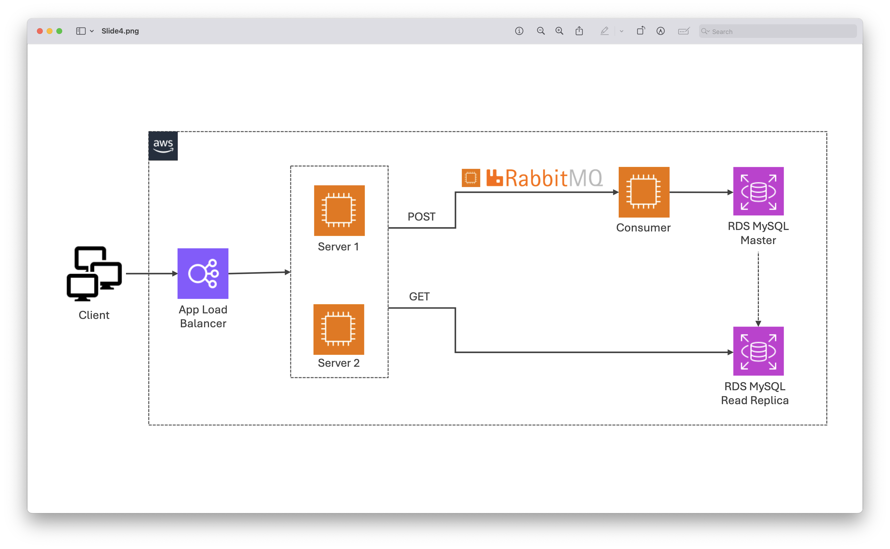
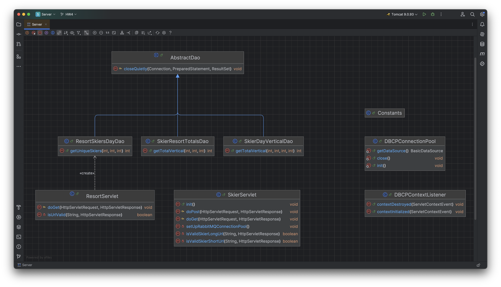
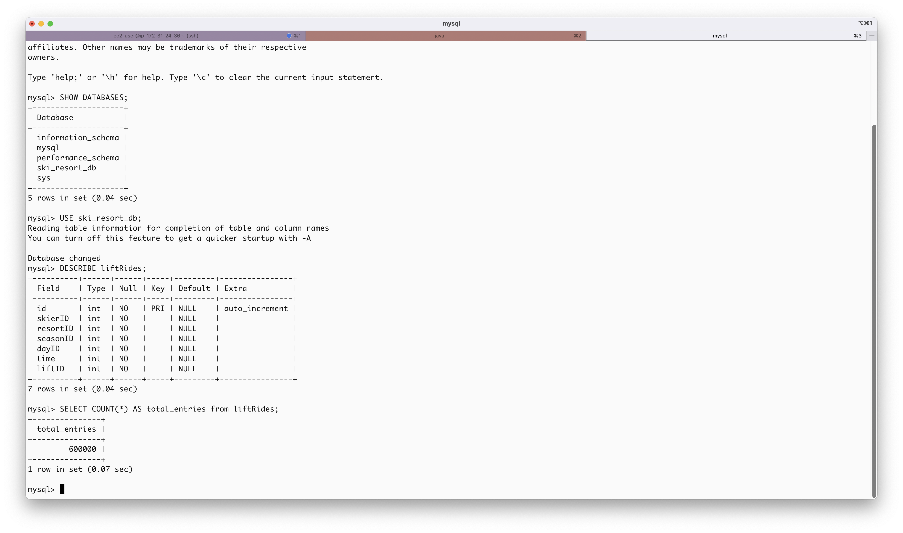
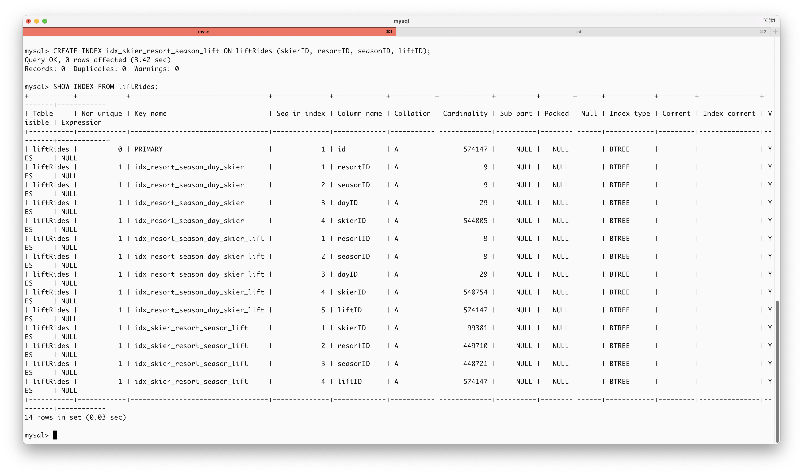
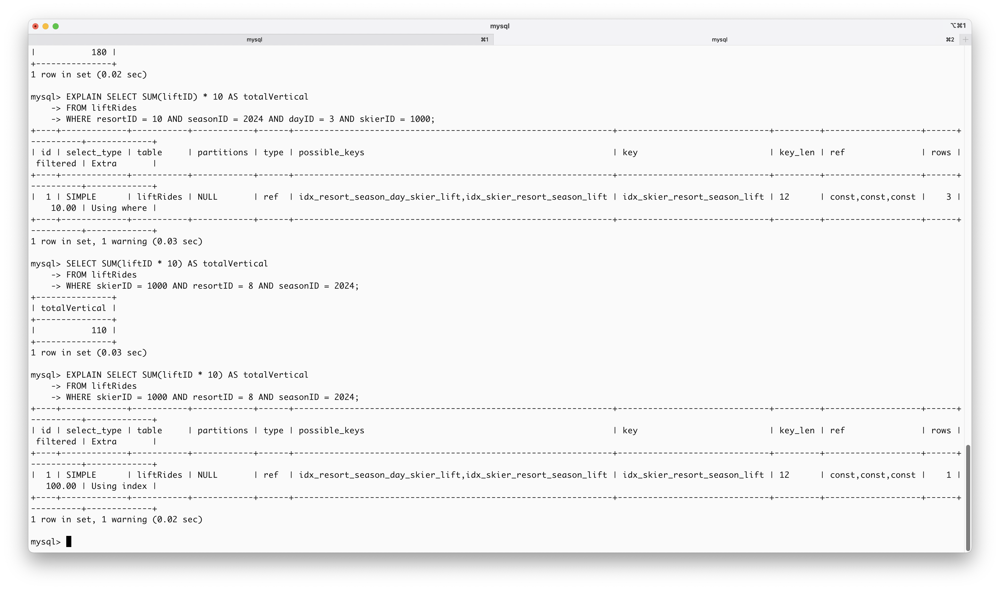
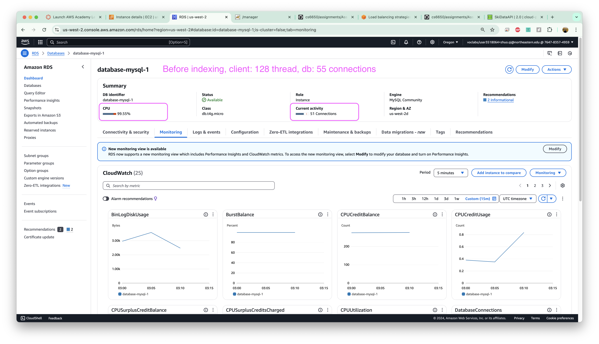
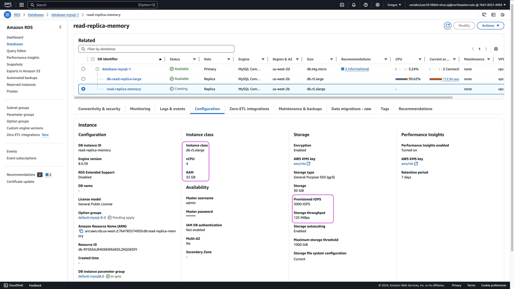
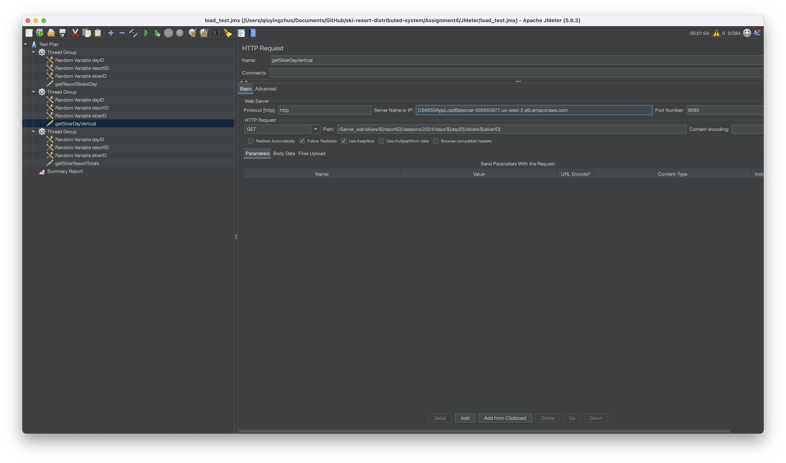
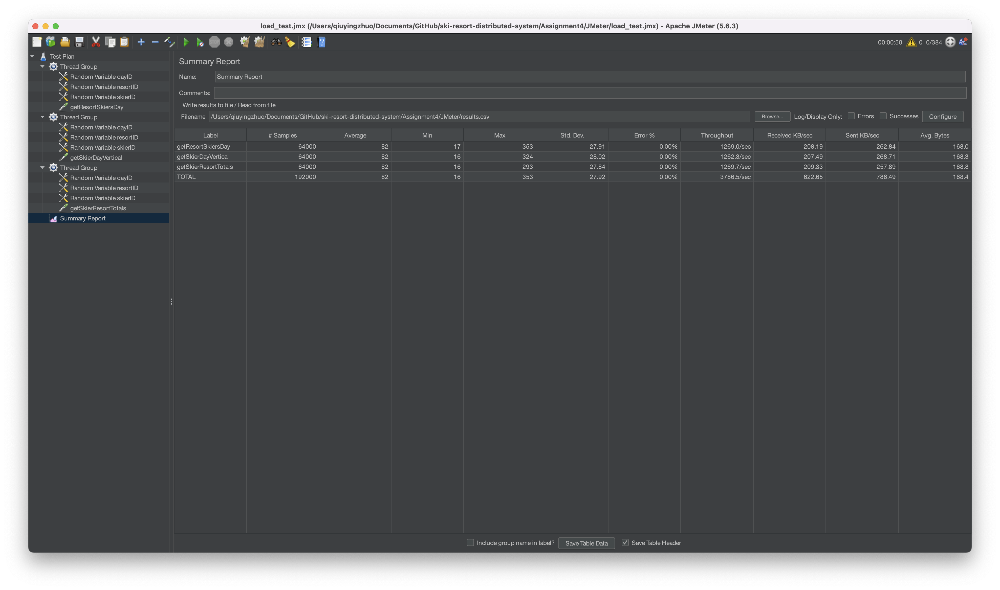
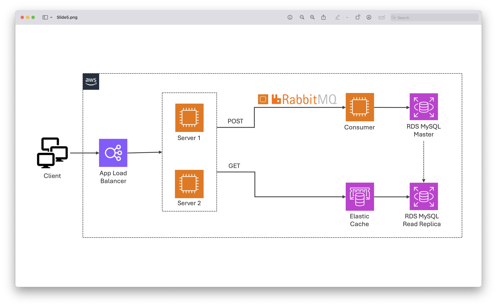

# Github Repository URL

Please visit this  [Github Repository](https://github.com/z-q-ying/ski-resort-distributed-system/tree/main/Assignment4).

# Architecture



# Implement the GET APIs

UML Diagram for `Server`:



Source folder structure for `Server`:

```
├── src
│   ├── main
│   │   ├── java
│   │   │   └── ski
│   │   │       └── resort
│   │   │           └── distributed
│   │   │               └── system
│   │   │                   ├── DBCPContextListener.java
│   │   │                   ├── ResortServlet.java
│   │   │                   ├── SkierServlet.java
│   │   │                   ├── dal
│   │   │                   │   ├── AbstractDao.java
│   │   │                   │   ├── DBCPConnectionPool.java
│   │   │                   │   ├── ResortSkiersDayDao.java
│   │   │                   │   ├── SkierDayVerticalDao.java
│   │   │                   │   └── SkierResortTotalsDao.java
│   │   │                   └── utils
│   │   │                       └── Constants.java
│   │   └── resources
│   └── test
│       └── java
```

At the core, `AbstractDao` serves as a base class providing common database utility methods, which are inherited by DAO classes like `ResortSkiersDayDao`, `SkierResortTotalsDao`, and `SkierDayVerticalDao`. These DAO classes handle specific database operations: for example, `ResortSkiersDayDao` retrieves unique skier counts, while `SkierResortTotalsDao` and `SkierDayVerticalDao` calculate total vertical statistics given certain parameters.

`DBCPConnectionPool` manages the database connection pool, offering a shared data source for DAO classes. `DBCPContextListener` ensures proper initialization and cleanup of the connection pool during application lifecycle events. The servlets (`ResortServlet` and `SkierServlet`) act like controllers in the system, handling HTTP requests and coordinating with DAO classes to fetch data.

# Populate the Database

A total of 600,000 entries are added with randomized values within the following ranges:

* `skierID`: 1 to 100,000
* `resortID`: 1 to 10
* `liftID`: 1 to 40
* `seasonID`: 2024
* `dayID`: 1 to 3
* `time`: 1 to 360

The screenshot below displays the **data model** used and confirms that the database now contains 600,000 entries.



# Actions taken to optimize the throughout

Indexing was applied to optimize the SELECT queries.



Each GET query was then executed, and the `EXPLAIN` command was used to verify the effectiveness of the indexing. The results showed that:
* The `select_type` was `SIMPLE`.
* Index usage was confirmed with `ref` or `const`.
* `filtered` values were at `100%` in the best case, indicating efficient filtering.
* Queries leveraged the index (`using index` or `where`) with minimal need to access full tables.



During early testing, the free-tier master database running the `db.t4g.micro` engine performed well with indexing but frequently exceeded its default CPU capacity or quickly exhausted available connections (default max connections set to `60`).



To address the high read load, a read replica was created using a more advanced, memory-optimized engine (both `db.r5.large` and `db.r5.xlarge` were tested). All `GET` traffic was redirected to this replica.



The combination of the stronger engine in the read replica and indexing significantly improved GET query throughput.

# Load test the GETs

JMeter configuration:
*   3 thread groups, one for each GET request, each with:
    *   128 threads
    *   500 iterations
    *   10-second ramp-up time



With a single server, the system handled `3,724` requests per second. According to the output CSV, the latency metrics were as follows: maximum latency at `266` ms, 99th percentile (P99) latency at `144` ms, mean latency at `84` ms, and median latency at `84` ms.



With a load balancer, the system handled `3,786` requests per second. The latter does not significantly improve despite the addition of a second server. It suggests that the `128 * 3` threads on the client side are likely approaching the limit of a single server (where all `200` threads of Tomcat are fully utilized), if not already exceeding it.

# Future improvement

